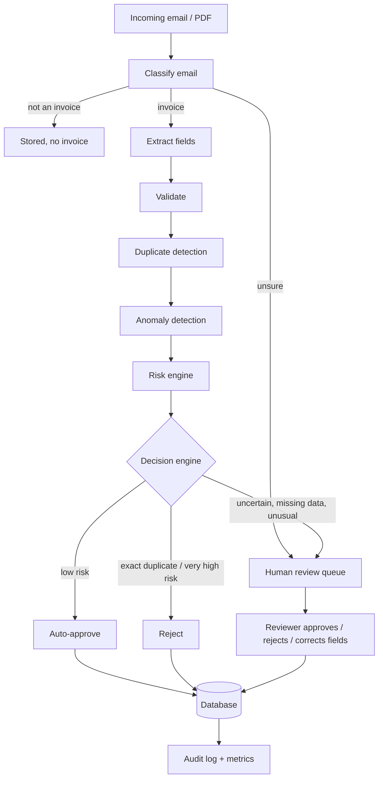

# OpsPilot AI

**Intelligent invoice workflow automation: classify, extract, validate, detect duplicates and anomalies, score risk, then auto-approve the safe ones and send the rest to a human, with a full audit trail.**

Small businesses lose hours every week reading invoice emails, retyping the details, checking for double payments and deciding what needs approval. OpsPilot AI automates the repetitive part and keeps a person in the loop for anything uncertain or risky.


## How it works



Every stage writes to the audit log, so any decision can be explained afterwards: what each stage saw, how long it took, and who (system or person) made the final call.

## Design decisions worth knowing

- **Signals, not verdicts.** Each stage only produces a 0-1 risk signal and human-readable flags. A separate engine combines them, so thresholds can be tuned without touching the detectors.
- **Noisy-OR risk scoring** (`1 - prod(1 - weight x signal)`) instead of a weighted average: one strong signal such as an exact duplicate is not diluted by clean signals elsewhere, while several weak signals add up gradually.
- **Hard rules beat scores.** Missing required fields, severe validation errors and amounts above an auto-approval limit always go to a human, even at low risk.
- **Anomaly detection is per vendor**, using median/MAD rather than mean/standard deviation, so past outliers do not teach the system that outliers are normal. Only approved invoices count as "normal" history.
- **Baseline first.** The Isolation Forest is benchmarked against a plain statistical rule. On this data the simple rule performs just as well, so both are used.
- **Classical ML and rules instead of an LLM.** For this scope they are fast, free, deterministic and easy to audit. An LLM extractor is the natural next step for messy real-world invoices.
- **Fails safe.** Unknown decisions, unsure classifications and cold-start vendors go to review or carry a risk penalty, never to silent approval.

## Results

Measured on a synthetic dataset (1,499 emails, with injected duplicates and anomalies), reproducible with the commands below.

| Component | Result |
|---|---|
| Email classifier (5 classes) | 100% on 300 held-out emails |
| Field extraction (816 invoices) | 0 wrong values; 100% found for vendor, number, due date, currency, amount; invoice date found 85.7%, PO number 91.8% (misses are reported as missing, with lower confidence) |
| Duplicate detection | 47 of 47 caught, 2 false alarms (95.9% precision) |
| Anomaly detection (chronological test split) | 9 of 9 caught; simple statistical rule: 0 false alarms; Isolation Forest at the 0.95 cutoff: 1 false alarm |
| **End to end** | **87.0% auto-approved** (710 of 816); **0 of 78** bad invoices auto-approved; 47 of 47 duplicates rejected; 31 of 31 anomalies sent to review; 28 of 738 good invoices (3.8%) still sent to a human |

**Read these numbers honestly.** The data is synthetic and templated, and the injected anomalies are large (4-10x the vendor's norm), so the scores are far better than real data would give. They show that the pipeline works end to end and how the thresholds trade automation against safety; they are not a claim about production accuracy. The Isolation Forest in the end-to-end run is trained on the same data it is scored on. The estimated time saving shown in the dashboard assumes 6 minutes of manual work per invoice at 30 per hour; it is an estimate, not a measurement.

## Quick start

```bash
python -m venv .venv
source .venv/bin/activate          # Windows PowerShell: .venv\Scripts\Activate.ps1
pip install -r requirements.txt

python -m app.ml.train_classifier  # trains and saves the email classifier
python -m app.ml.train_anomaly     # trains and saves the anomaly detector
uvicorn app.main:app --reload
```

Open http://127.0.0.1:8000/ and click **Load demo data**. API docs are at `/docs`.

With Docker:

```bash
docker build -t opspilot-ai .
docker run -p 8000:8000 -v opspilot-data:/data opspilot-ai
```

Reproduce the evaluations:

```bash
python -m scripts.evaluate_extraction
python -m scripts.evaluate_duplicates
python -m scripts.evaluate_decisions   # automation rate, leakage, false alarms, threshold sweep
pytest -q
```

## API

| Endpoint | Purpose |
|---|---|
| `POST /emails` | Run an email through the pipeline and store the outcome (idempotent on `message_id`) |
| `GET /review-queue` | Invoices waiting for a human, highest risk first |
| `POST /invoices/{id}/review` | Approve or reject, with optional field corrections |
| `GET /invoices`, `/invoices/{id}`, `/invoices/{id}/audit` | Records and the full audit trail |
| `GET /metrics` | Automation rate, pending reviews, processing time, estimated savings |

## Project layout

```
app/
  ingestion/     PDF text extraction
  extraction/    regex field extractor with per-field confidence
  validation/    business-rule checks on extracted data
  duplicates/    fuzzy duplicate matching
  anomaly/       per-vendor features, Isolation Forest, scoring
  risk/          risk engine (noisy-OR) and decision engine (rules + thresholds)
  review/        legal status transitions for human review
  services/      persistence, review workflow, metrics
  pipeline/      stage wrappers and the pipeline runner with automatic audit logging
  ml/            training scripts
  static/        dashboard (single HTML page)
  main.py        FastAPI app
scripts/         data generation and evaluation scripts
tests/           unit tests and API tests
```

## Limitations and next steps

- Synthetic data only; real invoices are messier (layouts, scans, multiple currencies and languages).
- Extraction is regex-based. Next: a trained or LLM-based extractor for unstructured invoices, scored with the same evaluation script.
- Anomaly detection looks at the amount only. Timing, payment terms and new-vendor checks are the obvious additions. The first three invoices from a new vendor cannot be judged.
- Duplicate lookup loads all stored invoices, which will not scale; narrow it in SQL.
- No authentication, so the reviewer name is trusted as typed. No database migrations (a production system would use Alembic).
- No live mailbox integration yet; emails are posted to the API.
