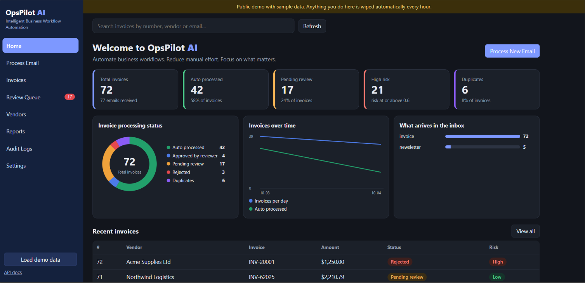
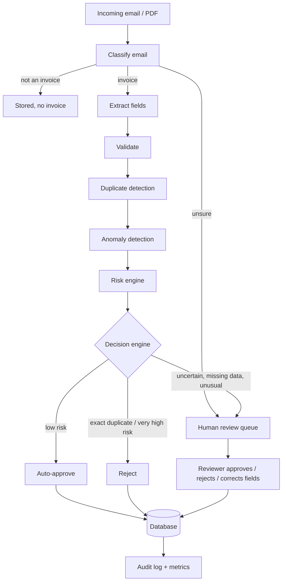

# OpsPilot AI

**Intelligent invoice workflow automation: classify, extract, validate, detect duplicates and anomalies, score risk, then auto-approve the safe ones and send the rest to a human, with a full audit trail.**

Small businesses lose hours every week reading invoice emails, retyping the details, checking for double payments and deciding what needs approval. OpsPilot AI automates the repetitive part and keeps a person in the loop for anything uncertain or risky.



## How it works



Every stage writes to the audit log, so any decision can be explained afterwards: what each stage saw, how long it took, and who (system or person) made the final call.

## Design decisions worth knowing

- **Signals, not verdicts.** Each stage only produces a 0-1 risk signal and human-readable flags. A separate engine combines them, so thresholds can be tuned without touching the detectors.
- **Noisy-OR risk scoring** (`1 - prod(1 - weight x signal)`) instead of a weighted average: one strong signal such as an exact duplicate is not diluted by clean signals elsewhere, while several weak signals add up gradually.
- **Hard rules beat scores.** Missing required fields, severe validation errors and amounts above an auto-approval limit always go to a human, even at low risk.
- **Anomaly detection is per vendor**, using median/MAD rather than mean/standard deviation, so past outliers do not teach the system that outliers are normal. Only approved invoices count as "normal" history.
- **Baseline first.** The Isolation Forest is benchmarked against a plain statistical rule. On this data the simple rule performs just as well, so both are used.
- **Classical ML and rules instead of an LLM.** For this scope they are fast, free, deterministic and easy to audit. An LLM extractor is the natural next step for messy real-world invoices.
- **Fails safe.** Unknown decisions, unsure classifications and cold-start vendors go to review or carry a risk penalty, never to silent approval.

## Results

Everything is measured on synthetic data, on **two datasets** with identical code. The *easy* set (1,499 emails) uses one clean template. The *hard* set (2,689 emails, generated by `scripts/generate_hard_data.py`) adds what real inboxes look like: varied labels and date/amount formats, vendor names only in signatures, vendor-specific invoice numbers, noisy duplicates (reformatted numbers, vendor typos, corrected amounts, resubmissions), legitimate look-alikes (monthly rent, identical same-day orders), subtler anomalies (mild spikes, bursts, brand-new vendors) and heavy-tailed vendors with price drift.

The third column feeds the later stages the *true* field values ("oracle extraction"), which separates how good the detection logic is from how good the extractor is.

| | Easy data | Hard data, regex extraction | Hard data, true fields |
|---|---|---|---|
| Email classifier accuracy | 100% | 100% | n/a |
| Extraction, fields found correctly (vendor / invoice no. / invoice date / due date / amount) | 100 / 100 / 86 / 100 / 100 % | 81 / 53 / 30 / 33 / 50 % | n/a |
| Wrong (not just missing) extracted values | 0 | 307 (292 wrong vendors) | n/a |
| Duplicates caught (recall) / precision | 100% / 96% | 28% / 100% | 96% / 86% |
| Anomalies caught, simple z-score rule (recall / precision) | 100% / 100% | 60% / 60% | 68% / 79% |
| Anomalies caught, Isolation Forest (recall / precision) | 100% / 90% | 10% / 20% | 68% / 71% |
| **Auto-approved, end to end** | **86.8%** | **8.4%** | **87.5%** |
| **Bad invoices auto-approved** | **0 of 78** | **9 of 173** | **40 of 173** |
| Good invoices sent to a human | 4.1% | 91.2% | 4.2% |

Raw reports: [`docs/results/`](docs/results/). Reproduce with `python -m scripts.benchmark`.

**What the hard benchmark shows**

- **Extraction is the bottleneck.** The regex extractor reads only the one date format it was written for (about 30% of dates on messy mail) and mistakes signature lines for vendor names. It fails safe, though: values below 0.9 confidence are right only 79% of the time, values at or above 0.9 are right 99.7%, and any missing required field routes the invoice to a human. That is why only 8.4% are auto-approved. The learned extractor below fixes most of this.
- **With true fields, the decision logic holds up**: 96% of duplicates caught and 87.5% automation. The precision drop (86%) is entirely the 12 legitimate identical orders ("twins") flagged as resubmissions.
- **Remaining leaks are the known gaps.** Of 40 bad invoices auto-approved, 25 are bursts (normal amounts, but too many invoices in a day, which the amount-only detector cannot see), 6 are the first invoice from a brand-new vendor (nothing to compare with), 6 are mild spikes within a vendor's natural variation, and 3 are vendor-name variants too different to match.
- **The Isolation Forest does not beat the simple rule**, because both see only the amount. It needs richer features before it can help.
- **The classifier is saturated** (100% on both sets): templated synthetic text is too easy to separate, so this number says nothing about real email. A real benchmark needs real, labelled emails.

### Learned extractor

The regex extractor is the main weakness on messy mail, so I replaced it with a learned one (`app/extraction/learned.py`). It finds every candidate (all date formats, US and European amounts, ID-like tokens, vendor-like lines), scores each from its context with a per-field logistic regression, and **abstains** below a confidence threshold instead of guessing. It also derives a missing due date from "Net 30" payment terms. It trains on the first 70% of the hard set and is tested on the held-out 30%, and on a **clean test set** whose labels and phrasing it has never seen ("Billed from:", "Total payable", ...). A second unseen set was used during development to find and fix weaknesses (for example, vendor lines labelled anything other than "Vendor:"), so the clean set is the honest number.

| Fields found correctly | Regex, held-out | Learned, held-out | Regex, unseen wording | Learned, unseen wording |
|---|---|---|---|---|
| Vendor | 81% (86 wrong) | 90% (0 wrong) | 64% (547 wrong) | 91% (0 wrong) |
| Invoice number | 55% | 92% | 58% | 79% |
| Invoice date | 28% | 100% | 0% | 86% |
| Due date | 33% | 90% | 3% | 79% |
| Amount | 51% (3 wrong) | 100% | 7% (4 wrong) | 100% |

| End to end (last 30%) | Auto-approved | Bad invoices auto-approved | Good invoices sent to a human | Approved with a wrong field |
|---|---|---|---|---|
| Regex | 9.9% | 1 of 47 | 89.2% | 3 of 45 |
| **Learned** | **67.5%** | 6 of 47 | 26.2% | **0 of 308** |
| True fields (ceiling) | 88.8% | 6 of 47 | 2.4% | 0 of 405 |
| Unseen wording: regex / **learned** / ceiling | 0.9% / **51.2%** / 89.8% | 0 / 3 / 3 of 41 | 99.0% / 44.4% / 2.0% | 1 of 4 / **0 of 231** / 0 of 405 |

- The learned extractor never returned a wrong value in any test; it misses or abstains instead. Most remaining misses on the held-out set are cases where the information is simply not in the email (no vendor name anywhere, or no payment terms).
- Weaknesses: a date format the candidate generator does not know (for example `01-Mar-2026`) is invisible to it, and invoice-number accuracy falls to 79% on unseen introductory phrasing. The PO-number figure is trivial because the synthetic data contains no PO-like decoys.
- The end-to-end comparison uses the plain z-score anomaly rule, so the three rows differ only in extraction. Report: [`docs/results/extractors.txt`](docs/results/extractors.txt).

### Anomaly detection v2: bursts and new vendors

The first version judged only the amount. Two leaks stood out in the hard-data results with true fields: bursts (25 of 40 leaked bad invoices) and first invoices from unknown vendors (6). Two additions, both visible in the audit log and the risk breakdown:

- **Burst signal** (`app/anomaly/burst.py`): compares how many invoices a vendor has sent today (including pending and rejected ones, because they did arrive) with that vendor's own normal daily rate, using a Poisson tail probability. It is a soft signal feeding the risk engine (weight 0.6), and stays silent until a vendor has 10 approved invoices.
- **New-vendor rule** (`app/risk/decision.py`): a first invoice from a vendor with too little history, above 2,000, always goes to a human.

| Hard data, true fields | Before | After |
| --- | --- | --- |
| Auto-approved | 87.5% | 83.3% |
| Bad invoices auto-approved | 40 of 173 | 20 of 173 |
| of which bursts / new vendors | 25 / 6 | 12 / 0 |
| Good invoices sent to a human | 4.2% | 7.4% |

Easy data is unchanged on leakage (0 of 78), with good invoices sent to a human rising from 4.1% to 5.0% because of the new-vendor rule.

**This is a trade-off, not a free win.** Every burst in the synthetic data comes from a busy vendor (about 0.5 invoices a day), and busy vendors legitimately send several invoices on one day, so count alone cannot separate a burst from natural clustering. Sensitivity is set by `SIGNAL_START` in `burst.py`; on the first 70% of the timeline, moving it from 2.2 (effectively off) to 1.2 cut leaks from 26 to 17 and raised the false-alarm rate from 6.3% to 8.3%. Choose the setting from what a missed invoice costs compared with a six-minute review. The default of 1.2 was fixed before sweeping, but the sweep and the table above use the same synthetic dataset.

**Read these numbers honestly.** All data is synthetic. The injected anomalies and duplicates follow patterns I chose, so the figures show how the pipeline behaves and where it breaks, not production accuracy. The Isolation Forest in the end-to-end run is trained on the same data it is scored on. The time saving shown in the dashboard assumes 6 minutes of manual work per invoice at 30 per hour; it is an estimate, not a measurement.

## Quick start

```bash
python -m venv .venv
source .venv/bin/activate          # Windows PowerShell: .venv\Scripts\Activate.ps1
pip install -r requirements.txt

python -m app.ml.train_classifier  # trains and saves the email classifier
python -m app.ml.train_anomaly     # trains and saves the anomaly detector
python -m app.ml.train_extractor   # trains the learned field extractor (the app falls back to regex without it)
uvicorn app.main:app --reload
```

Open http://127.0.0.1:8000/ and click **Load demo data**. API docs are at `/docs`.

With Docker:

```bash
docker build -t opspilot-ai .
docker run -p 8000:8000 -v opspilot-data:/data opspilot-ai
```

Reproduce the evaluations:

```bash
python -m scripts.generate_hard_data   # the harder dataset (a copy is already in data/)
python -m scripts.benchmark            # every evaluation on all datasets -> docs/results/
python -m scripts.compare_extractors  # regex vs learned extractor, held-out and unseen-wording tests
python -m scripts.evaluate_decisions --data data/synthetic_emails_hard.jsonl --oracle-extraction   # a single report
pytest -q
```

## API

| Endpoint | Purpose |
|---|---|
| `POST /emails` | Run an email through the pipeline and store the outcome (idempotent on `message_id`) |
| `GET /review-queue` | Invoices waiting for a human, highest risk first |
| `POST /invoices/{id}/review` | Approve or reject, with optional field corrections |
| `GET /invoices`, `/invoices/{id}`, `/invoices/{id}/audit` | Records and the full audit trail |
| `GET /metrics` | Automation rate, pending reviews, processing time, estimated savings |

## Run it with Docker

```
docker compose up --build              # API + dashboard on http://localhost:8000, plus a watcher on ./inbox
docker compose --profile mail up       # also poll an IMAP mailbox (OPSPILOT_IMAP_* in .env)
```

Drop `.eml` files into `./inbox` and they are processed within seconds. Models are trained while the image builds, and the SQLite database lives in a Docker volume.

## Security and public demo mode

The API has no users or roles, so **do not expose it to the internet as is.** Two switches cover the two cases:

| Setting | Use it for | What it does |
| --- | --- | --- |
| `OPSPILOT_API_KEY=...` | a private deployment | every API call must send header `X-API-Key`; the dashboard asks for the key once per tab |
| `OPSPILOT_DEMO_MODE=true` | a public showcase | loads sample data on start, rate-limits writes (60 per minute per IP), wipes and reseeds every hour, shows a banner |

Always on: request bodies over 1 MB get 413, and field lengths are capped (body 200,000 characters). The key is compared in constant time and never logged.

Known limits, stated plainly: there are still no user accounts (a reviewer's name is typed in, not verified), the size cap relies on the `Content-Length` header so keep a proxy limit in front of anything public, and behind a reverse proxy run uvicorn with `--proxy-headers` so the rate limit sees real client IPs. Demo mode resets the database, so never point it at real data.

## Mailbox integration

`python -m app.ingestion.poll` reads a real IMAP inbox and sends each new email to `POST /emails`, so invoices arrive without anyone posting JSON by hand.

```
cp .env.example .env               # fill in a THROWAWAY mailbox (Gmail needs an App Password)
uvicorn app.main:app               # terminal 1: the API
python -m app.ingestion.poll       # terminal 2: poll every 60 s (add --once for a single pass)
python -m scripts.send_test_emails --count 5 --pdf    # optional: mail yourself sample invoices
```

Behaviour worth knowing:

- **Arrival time comes from the mail server (IMAP INTERNALDATE), not the `Date` header**, because the burst detector depends on it and a sender can forge a header.
- **Safe to retry.** Mail is fetched with `BODY.PEEK` and marked read only after the API accepted it. If the API is down the mail stays unread and the next cycle retries; the API is idempotent on `message_id`, so a crash can never create a second invoice.
- **One bad email cannot block the queue.** If the API rejects a message it is flagged in the mailbox and skipped from then on.
- **Attachments.** Text PDFs are read (first 10 pages, up to 10 MB) and appended to the body. Scans, images and other types are noted in the body, so the reviewer sees what could not be read and the invoice goes to review for missing fields.
- Credentials are read from environment variables or a git-ignored `.env`, held as secrets and never logged.

### No mail account? Use .eml files

The same parsing and API path works from a folder of saved emails, with no login:

```
python -m scripts.send_test_emails --count 6 --pdf --out-dir inbox    # make sample invoice emails
python -m app.ingestion.folder inbox                                   # API must be running
```

Processed files move to `inbox/processed/`, rejected ones to `inbox/rejected/`, and files stay put if the API is down. Any mail client can export a message as `.eml`, so this also works for real emails.

Tested with a fake IMAP server that mimics the `imaplib` response shapes, plus an end-to-end test through the real API. It has not been run against every provider, so treat the first run on a new mailbox as a test.

## Project layout

```
app/
  ingestion/     PDF text extraction, IMAP mailbox poller
  extraction/    regex extractor, learned extractor (candidates + per-field classifiers), test oracle
  validation/    business-rule checks on extracted data
  duplicates/    fuzzy duplicate matching
  anomaly/       per-vendor features, Isolation Forest, scoring
  risk/          risk engine (noisy-OR) and decision engine (rules + thresholds)
  review/        legal status transitions for human review
  services/      persistence, review workflow, metrics
  pipeline/      stage wrappers and the pipeline runner with automatic audit logging
  ml/            training scripts
  static/        dashboard (single HTML page)
  main.py        FastAPI app
scripts/         data generation, evaluation and benchmark scripts
docs/results/    saved benchmark reports (easy, hard, hard with true fields)
tests/           unit tests and API tests
```

## Limitations and next steps

- Synthetic data only; real invoices are messier (layouts, scans, multiple currencies and languages).
- The learned extractor is trained on templated synthetic text and cannot read date formats it has no candidate rule for. Next: train on real invoices, add layout-aware features for PDFs, and try an LLM-based extractor scored with the same comparison script.
- Bursts are only partly detectable from counts (12 of 25 still leak on busy vendors), mild spikes within a vendor's natural variation still leak, and the Isolation Forest used in the end-to-end replay is trained on the same data it is scored on.
- Duplicate lookup loads all stored invoices, which will not scale; narrow it in SQL.
- No authentication, so the reviewer name is trusted as typed. No database migrations (a production system would use Alembic).
- The mailbox poller is IMAP only, polling rather than push, and needs an app password; OAuth (Gmail API, Microsoft Graph) would be the production route. Scanned PDFs and images are not read (no OCR).
